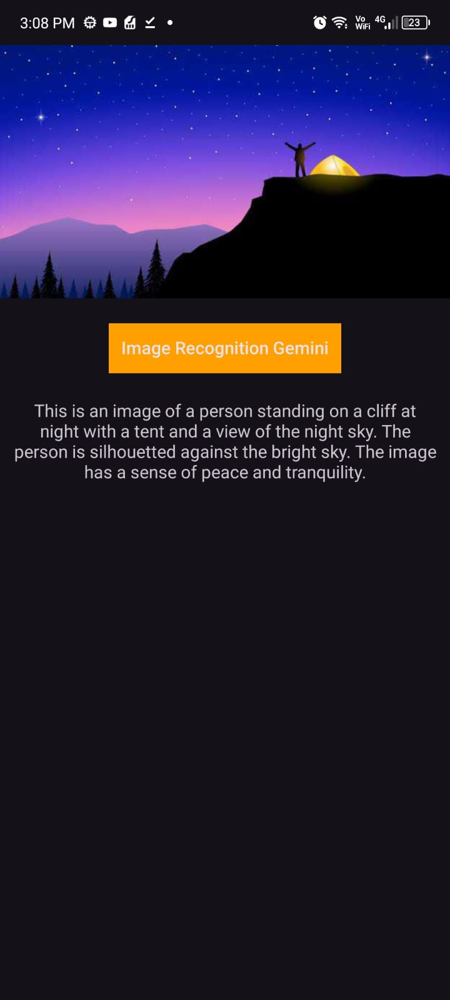
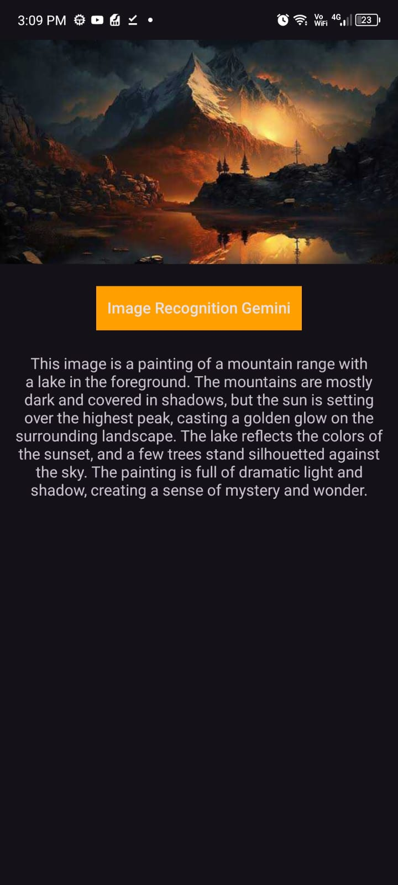

# Food2Fork

Capture or select an image, and let powerful AI technology instantly identify what's in it. Powered by Gemini SDK,

## App design and architecture
Project is written in Kotlin.

Project uses third-party libraries:
- [Button-Animations](https://github.com/leandroBorgesFerreira/LoadingButtonAndroid)
- [Gemini-SDK](https://developer.android.com/ai/google-ai-client-sdk)
- [Image-Picker](https://github.com/Drjacky/ImagePicker)
- [Google-Secrets](https://developers.google.com/maps/documentation/android-sdk/secrets-gradle-plugin)

## License
Licensed under the [GNU General Public License v3.0](LICENSE)
